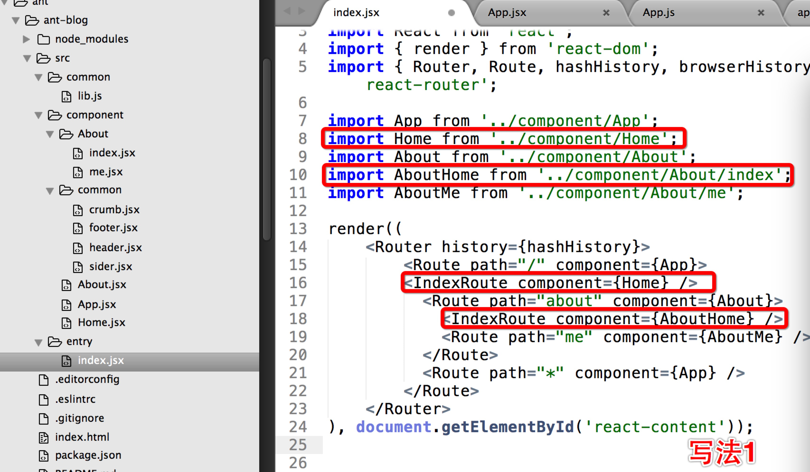
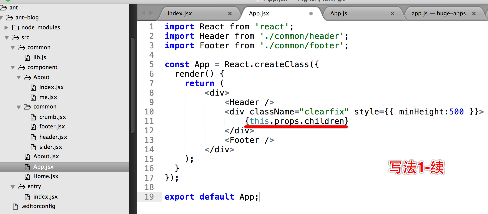
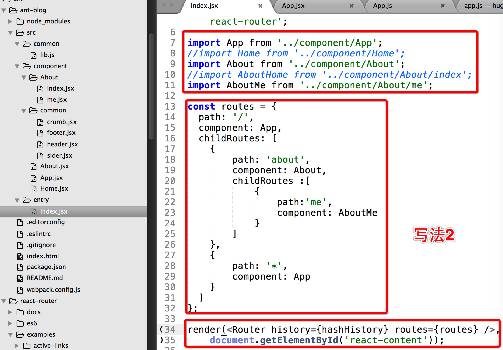
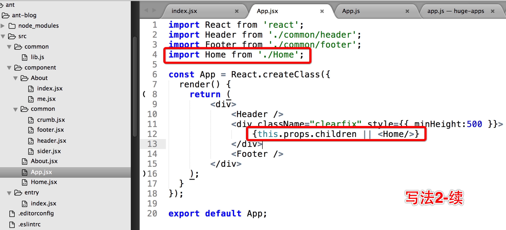

# antd-demo

## base on

[ant.design](http://ant.design/)

[react-router](https://github.com/rackt/react-router)

[webpack](https://github.com/webpack/webpack)

[less](http://less.bootcss.com/)

## Environment

```
node >= 4
```

## Code Style

https://github.com/airbnb/javascript

## Develop

```
npm run dev
```

访问 http://127.0.0.1:8989 

## Build

```
npm run build
```

## More Info Of React-Router

### 写法1

 

 

### 写法2

 

 


